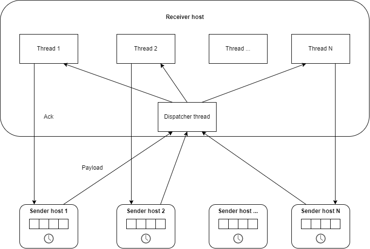
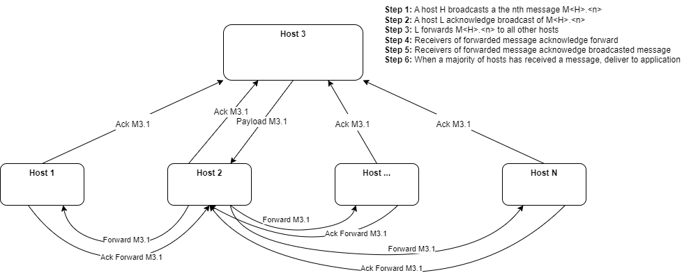

## School project that implements multiple distributed algorithm abstractions

1. [Reliable broadcast (unicast)](https://github.com/magnuskalland/distributed-algorithms/tree/main)
2. [Uniform reliable broadcast and FIFO ordering](https://github.com/magnuskalland/distributed-algorithms/tree/fifo)
3. [Lattice agreement](https://github.com/magnuskalland/distributed-algorithms/tree/lattice-agreement)

#### Reliable broadcast (unicast)

This abstraction implements a reliable communication channel over UDP. Each sender sends a predetermined number of messages that is received and handled by a thread on the receiving side.

Reliability is ensured by replying with a _selective acknowledgement_ packet. Compared to TCP, a SACK does not indicate packet loss, it is simply an acknowledgement of the packet corresponding to the containing sequence number.

In contrast to the stop-and-go protocol for reliability, performance is enhanced my sending several messages per _window_. This way, we implement a primitive _sliding window_ protocol. Each window is initialized to
`min(default socket buffer size in bytes, predetermined number of messages to send in bytes)`
The **window size is static**, meaning the mechanism will not contribute to less packet loss. However, since the project is meant to only run locally, we can easily detect packet losses during development, and tune the [configuration](https://github.com/magnuskalland/distributed-algorithms/blob/main/src/include/config.hpp) to that. Until now, packet loss has never been detected when transmitting over links without loss, reordering and delays. We can therefore conclude with that a receiving buffer never overflows, even in the best conditions where senders send at an very high speed.

#### Uniform reliable broadcast and FIFO ordering

Built on top of reliable broadcast, this implementation features guaranteed FIFO ordering of messages broadcasted by each sender.

